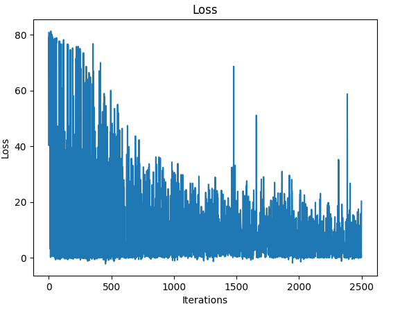
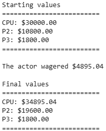
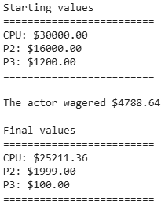
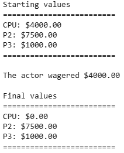

# Final Jeopardy! Wagering Strategy with Reinforcement Learning

This project uses Deep Reinforcement Learning to train an agent to make optimal wagers for Final Jeopardy (from the game show Jeopardy!).

---

## Table of Contents
- [Motivation](#motivation)
- [Features](#features)
- [Demo / Screenshots](#demo--screenshots)
- [Installation](#installation)
- [Usage](#usage)
- [Technologies Used](#technologies-used)
- [How It Works](#how-it-works)
- [Results](#results)
- [Future Work](#future-work)
- [License](#license)
- [Acknowledgements](#acknowledgements)

---

## Motivation

I wanted to explore reinforcment leanring in a scenario I found interesting to better understand how to implement reinforcement learning algorithms.
It was inspired by curiosity about how professional Jeopardy players decide how much to wager in high-stakes situations.

---

## Features

- Uses the REINFORCE Algorithm (a policy gradient method) ([https://arxiv.org/pdf/2010.11364](url))
- Simulates thousands of Jeopardy games to train the model
- Generates and evaluates wagering strategies based on game context
- Compares learned strategies against naive or rule-based baselines
- Checks for statistical significance in results

---

## Training
The model was trained using 2500 episodes.
Here is the graph of the loss as training progressed:


---

## Demo

For a full demo of the training process and the algorithm in action, visit this Google Colab notebook:
[https://colab.research.google.com/drive/1QzOLkRnD8Ss2zOXVRdvPdjLw7Vc4ilEu?usp=sharing](url)

Here is how the actor performs in different situations:

**Runaway game:**




**Close game**




**Comeback game**



---

## Installation

Clone this repository and install the required dependencies:

```bash
git clone https://github.com/XanderBys/Jeopardy.git
cd Jeopardy
pip install -r requirements.txt
